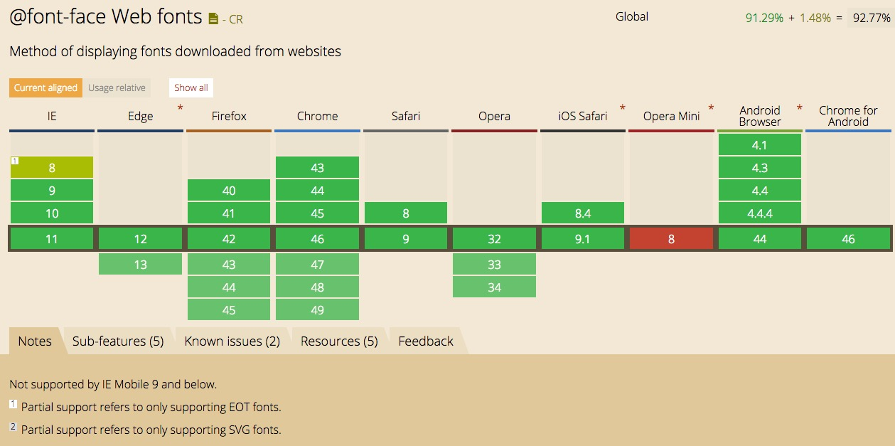
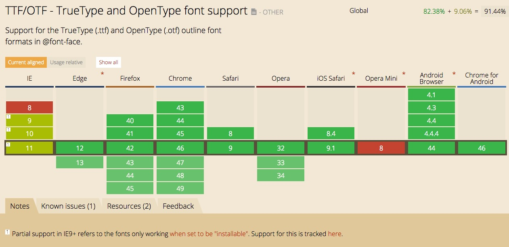
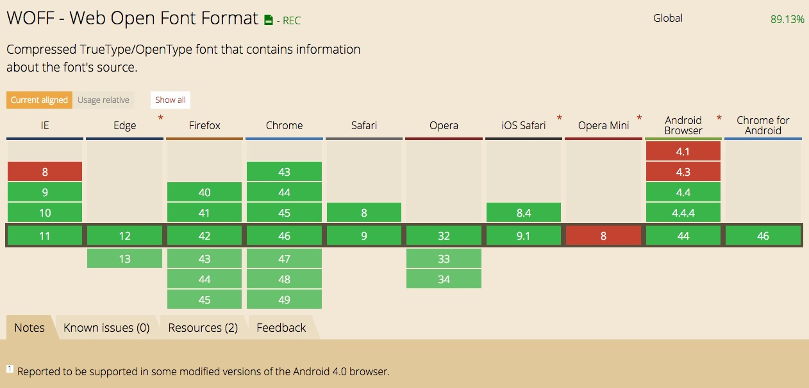
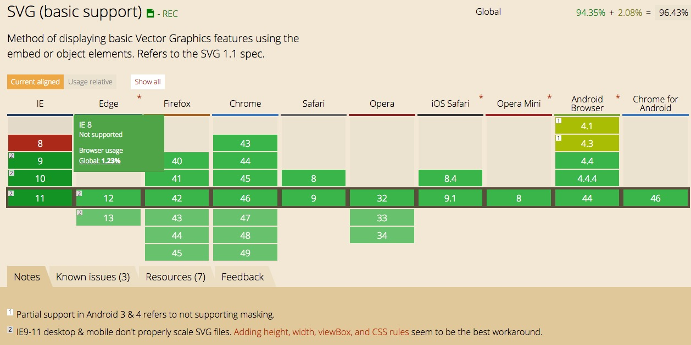
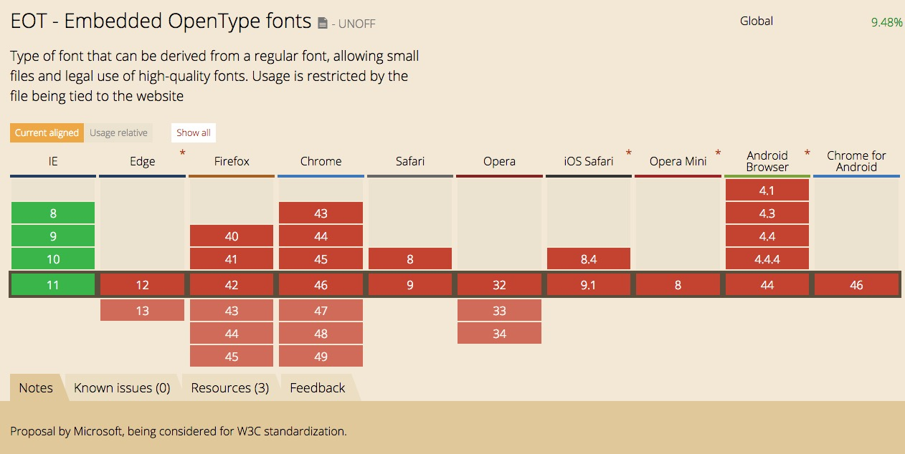

# 移动端前端开发优化分享
## 字体部分优化
### TrueType (.ttf)
　　`Windows` 和 `Mac` 系统最常用的字体格式，其最大的特点就是它是由一种数学模式来进行定义的基于轮廓技术的字体，这使得它们比基于矢量的字体更容易处理，保证了屏幕与打印输出的一致性。同时，这类字体和矢量字体一样可以随意缩放、旋转而不必担心会出现锯齿。

### EOT – Embedded Open Type (.eot)
　　嵌入字体格式 `(EOT)` 是微软开发的一种技术，允许 `OpenType` 字体嵌入到网页并可以下载至浏览器渲染，浏览器根据 `CSS` 中 `@font-face` 的定义，下载，渲染这种 `.EOT` 后缀的字体文件。这些文件只在当前页活动的状态下，临时安装在用户的系统中。

### OpenType (.otf)
　　`OpenType` 是一种可缩放字型 `(scalable font)` 电脑字体类型，采用 `PostScript` 格式，是美国微软公司与Adobe公司联合开发，用来替代 `TrueType` 字型的新字型。这类字体的文件扩展名为 `.otf`，类型代码是 `OTTO`，现行标准为 `OpenType 1.4`。`OpenType` 最初发表于1996年，并在2000年之后出现大量字体。它源于微软公司的 `TrueType Open` 字型，`TrueType Open` 字型又源于 `TrueType` 字型。`OpenType font` 包括了Adobe CID-Keyed font技术。Adobe公司已经在2002年末将其字体库全部改用OpenType格式。

### WOFF – Web Open Font Format (.woff)
　　相对于 TrueType 和 OpenType ，WOFF（Web开发字体格式）是一种专门为了 Web 而设计的字体格式标准，它并不复杂，实际上只是对于 TrueType / OpenType 等字体格式的封装，并针对网络使用加以优化：每个字体文件中含有字体以及针对字体的元数据（Metadata），字体文件被压缩，以便于网络传输，并且不包含任何加密或者 DRM 措施。包括 Adobe、 Lino Type、Monotype 在内的几乎所有主要的字体供应商都加入到支持 WOFF 的行列中来

### SVG (Scalable Vector Graphics) Fonts (.svg)
　　顾名思义，就是使用 `SVG` 技术来呈现字体，还有一种 `gzip` 压缩格式的 `SVG` 字体 `.svgz` 。`SVG` 可缩放矢量图形`（Scalable Vector Graphics）` 是基于可扩展标记语言 `(XML)`，用于描述二维矢量图形的一种图形格式。`SVG` 由W3C制定，是一个开放标准。SVG严格遵从XML语法，并用文本格式的描述性语言来描述图像内容，因此是一种和图像分辨率无关的矢量图形格式。SVG可以使你设计的网页可以更加精彩细致，使用简单的文本命令，SVG可实现色彩线性变化、路径、自定义字体、透明效果、滤镜效果等各式常见的图形图像效果。

## 字体文件在服务器端开启gzip压缩

#### 什么是 `GZIP` 压缩

GZIP网页压缩，是一种WEB服务器与浏览器之间共同遵守的协议，也就是说WEB服务器和浏览器都必须支持该技术才能实现GZIP压缩，而当下主流的浏览器都是支持GZIP压缩，包括IE6、IE7、IE8、IE9、FireFox、谷歌浏览器、Opera等，而常见的WEB服务器通常有Apache和IIS两种。

GZIP最早由Jean-loup Gailly和Mark Adler创建，用于UNIX系统的文件压缩。我们在Linux中经常会用到后缀为.gz的文件，它们就是GZIP格式的。目前，GZIP已经成为Internet上使用非常普遍的一种数据压缩格式，或者说一种文件格式。

GZIP压缩的比率往往在3倍到10倍。

#### 浏览器对 `@font-face` Web fonts 的支持情况:

  
#### ttf/otf 浏览器支持情况

  
#### woff 浏览器支持情况

  
#### svg 浏览器支持情况

  
#### eot IE 特有支持

**字体文件对应的 minetype **   

	- application/font-woff 	woff  
	- application/font-sfntotf 	ttf
	- application/vnd.ms-fontobject		eot
	- image/svg+xml		svg svgz

以 [m.meizu.com](m.meizu.com) 网站中 `KaiGenGothicCN-Light.woff` 字体文件为例

开启前字体文件大小为 `311kb`，开启后 `223kb`，相比开启前压缩了 `30%` 左右

### 步骤一：登录远程服务器

`ssh 用户名@远程ip地址` 输入密码

### 步骤二：修改 nginx 配置文件 mime.types 文件
     
打开配置文件，添加如下几个配置项: 
   
	application/font-woff 	woff  
	application/font-sfntotf 	ttf
	application/vnd.ms-fontobject		eot
	image/svg+xml		svg svgz

### 步骤三：修改 nginx 配置文件 nginx.conf 文件

打开 `nginx.conf` 文件，添加如下配置项：   

	gzip_types		text/plain application/x-javascript text/css application/xml application/font-woff application/vnd.ms-fontobject application/font-sfnt image/svg+xml
	
这里面新增的配置项就是刚刚在 `mime.types` 里面配置的键

**修改了配置文件，需要重启nginx**

**重启 nginx：/data/nginx/sbin/nginx -s reload**